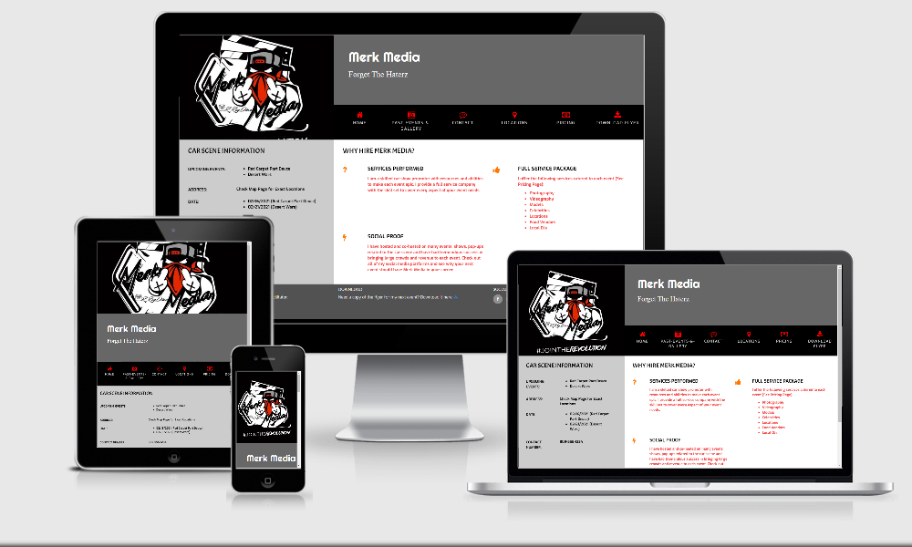
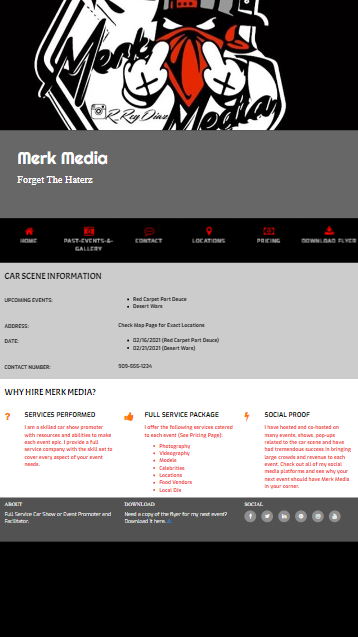
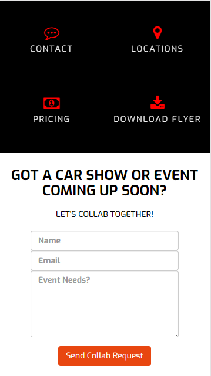
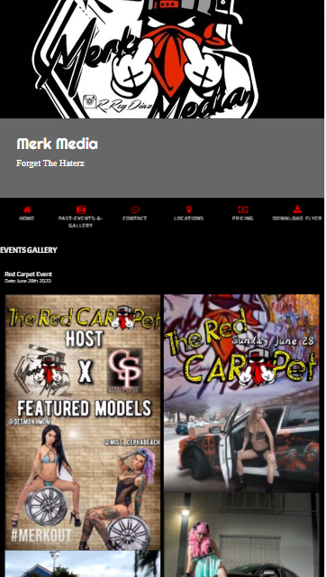
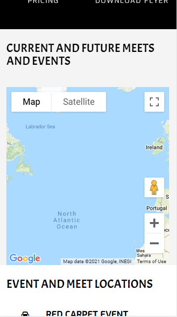
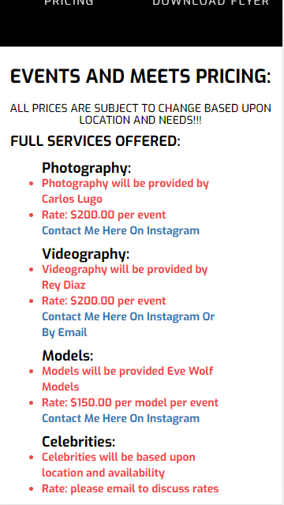
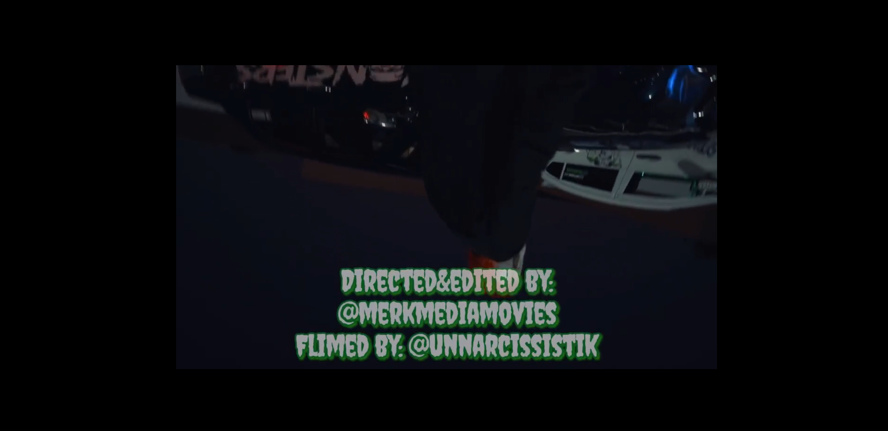

<h1 align="center">Merk Media Website</h1>

[View the live project here.]( https://phantom82aj.github.io/milestone-2-Interactive-Frontend/)

This is a webpage for a car event promoter in the Southern California car scene. It has been is created to correctly function and be accessible on a range of devices, making it easy to navigate for potential clients and car clubs.

<h2 align="center"></h2>

## User Experience (UX)

-   ### User Experiences

    -   #### First Time Visitor Outcome

        1. As a First Time Visitor, I want to easily understand the main purpose of the site and see what services are offered to the car community.
        2. As a First Time Visitor, I want to be able to easily navigate throughout the site to find content and contact forms.
        3. As a First Time Visitor, I want to see past events and see how they coorelate with services offered. I also want to locate their social media links to see their followings on social media to determine their popularity and following.
        4. As a First Time Visitor, I want to interact with the website to achieve my goals and complete the task and reason for visiting the website.

    -   #### Returning Visitor Goals

        1. As a Returning Visitor, I want to collaborate and get in contact for future events.
        2. As a Returning Visitor, I want to find pricing updates and promotional offers.
        3. As a Returning Visitor, I want to see updated information as to past events and future ones and where their locations are on a Google map.

    -   #### Frequent User Goals
        1. As a Frequent User, I want to check to how well the host responds to inquiries.
        2. As a Frequent User, I want to check to see if there are any new events held or services provided for.
        3. As a Frequent User, I want to send emails on collaborations and celebrity availability and location availability.

-   ### Design
    -   #### Color Scheme
        -   The main colors used are black, maroon, grey, and white.
    -   #### Typography
        -   The Sans Serif is the main font used with Roboto as the fallback font in case for any reason the font isn't being imported into the site correctly. Exo and Acme were used in headings and titles due to its attractiveness and clean lines. San-Serif is a clean font used frequently in design elements, so it is both attractive and easy to look at.
    -   #### Imagery
        -   Imagery is the key element on the entire website. The large, background logo image is designed to stand out and capture the user's eye. It also has a simple but sleek appearance. In the Gallery page past pictures and video were added to give a visual experience to the user for added enjoyment of the site.

*   ### Wireframes

    -   Home Page Wireframe - [View](https://phantom82aj.github.io/milestone-2-Interactive-Frontend/index.html)

    -   Mobile Wireframe - [View](https://phantom82aj.github.io/milestone-2-Interactive-Frontend/index.html)

    -   Contact Us Page Wireframe - [View](https://phantom82aj.github.io/milestone-2-Interactive-Frontend/contact.html)

    -  Past Events & Gallery Page Wireframe - [View](https://phantom82aj.github.io/milestone-2-Interactive-Frontend/events_gallery.html)

    -  Locations Page Wireframe - [View](https://phantom82aj.github.io/milestone-2-Interactive-Frontend/locations.html)

    -  Pricing Page Wireframe - [View](https://phantom82aj.github.io/milestone-2-Interactive-Frontend/pricing.html)

    -  Download Flyer Page Wireframe - [View](https://phantom82aj.github.io/milestone-2-Interactive-Frontend/assets/videos/merkmediamovies.mp4)


## Features

-   Responsive on all device sizes

-   Interactive elements

-   Email coorespondence

-   Google map locations

## Technologies Used

### Languages Used

-   [HTML5](https://en.wikipedia.org/wiki/HTML5)
-   [CSS3](https://en.wikipedia.org/wiki/Cascading_Style_Sheets)
-   [Javascript](https://en.wikipedia.org/wiki/JavaScript)
-   [Google Map API](https://en.wikipedia.org/wiki/Google_Maps#Google_Maps_API)
-   [JQuery](https://en.wikipedia.org/wiki/JQuery)
-   [EmailJS](https://www.emailjs.com/) 

### Frameworks, Libraries & Programs Used

1. [Bootstrap 4.4.1:](https://getbootstrap.com/docs/4.4/getting-started/introduction/)
    - Bootstrap was used to assist with the responsiveness and styling of the website in both html and css.
1. [Hover.css:](https://ianlunn.github.io/Hover/)
    - Hover.css was used on the Social Media icons in the footer to add the float transition while being hovered over.
1. [Google Fonts:](https://fonts.google.com/)
    - Google fonts were used to import the 'Roboto', 'Acme', and 'Exo' fonts into the style.css file which is used on all pages throughout the project.
1. [Font Awesome:](https://fontawesome.com/)
    - Font Awesome was used on all pages throughout the website to add icons for aesthetic and UX purposes.
1. [jQuery:](https://jquery.com/)
    - jQuery came with Bootstrap to make the navbar responsive but was also used for the smooth scroll function in JavaScript. JQuery was also used to simiplify Javascript coding while manipulating the DOM.
1. [Git](https://git-scm.com/)
    - Git was used for version control by utilizing the Gitpod terminal to commit to Git and Push to GitHub.
1. [GitHub:](https://github.com/)
    - GitHub is used to store the projects code after being pushed from Git.
1. [EmailJS:](https://emailjs.com/)
    - EamilJS was used to connect API on contact page to allow users to email site host for event collaborations and needed services. 
1. [Google Maps:](https://developers.google.com/maps)
    - Google Maps API was used for mapping locations of past and future events. Icons on the map were placed for locating events.

## Testing

The W3C Markup Validator and W3C CSS Validator Services were used to validate every page of the project to ensure there were no syntax errors in the project.

-   [W3C Markup Validator](https://validator.w3.org/#validate_by_input) - [Results](https://validator.w3.org/nu/#textarea)
-   [W3C CSS Validator](https://jigsaw.w3.org/css-validator/#validate_by_input) - [Results](https://jigsaw.w3.org/css-validator/validator)

### Testing User Stories from User Experience (UX) Section

-   #### First Time Visitor Goals

    1. As a First Time Visitor, I want to easily navigate the site and learn more about the services offered and past services rendered, in addition I want to have the ability to send emails and check Google Maps.

        1. Upon entering the site, users are automatically shown with a easily readable navigation bar to go to the page of their choice. Underneath the navigation bar is the most current event happening with full details. The footer has all social media links as well as the option to download the most current flyer.
        2. The page choices are made immediately below the company banner/logo.
        3. The user has multiple options, click any page link action buttons or scroll down. Both options will give valuable user information about the company.
        4. On the locations page I was able to easily access Google maps and check for location markers.
        5. On the contact page I was able to input data and successfully send an email to website host.

    2. As a First Time Visitor, I want to be able to easily be able to navigate throughout the different pages to find content.

        1. The site has been designed to be fluid and never to disrupt the user experience. At the top of each page there is a navigation bar that is identical on all pages, each page has the hover feature to tell the user which page they are currently on.
        2. At the bottom of the first 6 pages there is a redirection call to action to ensure the user always has somewhere to go and doesn't feel trapped as they get to the bottom of the page.
        3. On the Contact Us Page, after a form response is submitted, the page refreshes the information and clears out the previously used information. 

    3. As a First Time Visitor, I want to look for previous services rendered to understand what their past clients had purchased. I also want to locate their social media links to see their following on social media to determine how trusted and known they are.
        1. Once the new visitor has seen the past events they will have a better understanding of the services offered.
        2. Each visitor can select the services they dersire individually.
        3. Each visitor can check pricing for services and send an inquiry email to negotiate business. 

-   #### Returning Visitor Goals

    1. As a Returning Visitor, I want to find the new sponsored events and promotional deals.

        1. These are clearly shown in the Past Events & Gallery page.
        2. If interested in services again they will be directed to the Contact Us page for communication via email to the website email services.
        3. On the pricing page a potential customer can select which services they require and contact host via email.

    2. As a Returning Visitor, I want to find the best way to get in contact with the company with any additional questions I may have.

        1. The navigation bar clearly highlights the "Contact Us" Page.
        2. Here they can fill out the form on the page or are told that alternatively they can message the company on social media or directly send an email.
        3. The footer contains links to the company's Facebook, Twitter and Instagram, etc social media pages.
        4. Whichever link they click, it will be open up in a new tab to ensure the user can easily get back to the website.
        5. The email button is set up to automatically open up your email app and autofill there email address in the "To" section.

-   #### Frequent User Goals

    1. As a Frequent User, I want to check to see if there are any newly added events and promotional deals.

        1. The user would already be accustomed with the website layout and navigation.

    2. As a Frequent User, I want to check to see if there are any new blog posts or event updates.

        1. The user would already be comfortable with the website layout and can easily click the blog link.

    3. As a Frequent User, I want to contact the developer/company for future events and any new services rendered.
        1. At the bottom of every page their is a footer which content is consistent throughout all pages.
        2. The user can download a copy of the current event flyer.
        3. There is information pertaining to the next upcoming event on the Home page.

### Further Testing

-   The Website was tested on Google Chrome, Internet Explorer, Microsoft Edge and Safari browsers.
-   The website was viewed on a variety of devices such as Desktop, Laptop, tablet, and Galaxy Note 10.
-   A large amount of testing was done to ensure that all pages were linking correctly.
-   Friends and family members were asked to review the site and documentation to point out any bugs and/or user experience issues.

<h2 align="center"></h2>
<h2 align="center"></h2>
<h2 align="center"></h2>
<h2 align="center"></h2>
<h2 align="center"></h2>
<h2 align="center"></h2>

### Known Bugs

-   On some mobile devices the logo pushes the size of screen out more than any of the other content on the page.
    -   The flyer stalls in downloading occasionaly.
-   On some mobile devices the text appears pushed further to one side more than the other.
    -   On the Past Events and Gallery page the images shift to the left on computer screen view.
-   On the pricing page the text shifts to the left on computer view screen.

## Deployment

### GitHub Pages

The project was deployed to GitHub Pages using the following steps...

1. Log in to GitHub and locate the [GitHub Repository](https://github.com/phantom82aj/milestone-one)
2. At the top of the Repository (not top of page), locate the "Settings" Button on the menu.
    - Alternatively Click [Here](https://raw.githubusercontent.com/) for a GIF demonstrating the process starting from Step 2.
3. Scroll down the Settings page until you locate the "GitHub Pages" Section.
4. Under "Source", click the dropdown called "None" and select "Master Branch".
5. The page will automatically refresh.
6. Scroll back down through the page to locate the now published site [link](https://phantom82aj.github.io/milestone-2-Interactive-Frontend/) in the "GitHub Pages" section.

### Forking the GitHub Repository

By forking the GitHub Repository we make a copy of the original repository on our GitHub account to view and/or make changes without affecting the original repository by using the following steps...

1. Log in to GitHub and locate the [GitHub Repository](https://phantom82aj.github.io/milestone-2-Interactive-Frontend/)
2. At the top of the Repository (not top of page) just above the "Settings" Button on the menu, locate the "Fork" Button.
3. You should now have a copy of the original repository in your GitHub account.

### Making a Local Clone

1. Log in to GitHub and locate the [GitHub Repository](https://phantom82aj.github.io/milestone-2-Interactive-Frontend/)
2. Under the repository name, click "Clone or download".
3. To clone the repository using HTTPS, under "Clone with HTTPS", copy the link.
4. Open Git Bash
5. Change the current working directory to the location where you want the cloned directory to be made.
6. Type `git clone`, and then paste the URL you copied in Step 3.

```
$ git clone https://phantom82aj.github.io/milestone-2-Interactive-Frontend/
```

7. Press Enter. Your local clone will be created.

```
Click [Here](https://help.github.com/en/github/creating-cloning-and-archiving-repositories/cloning-a-repository#cloning-a-repository-to-github-desktop) to retrieve pictures for some of the buttons and more detailed explanations of the above process.

## Credits

### Code

-   The html, css, JavaScript came from Code Institue framework

-   [Bootstrap4](https://getbootstrap.com/docs/4.4/getting-started/introduction/): Bootstrap Library used throughout the project mainly to make site responsive using the Bootstrap Grid System.

### Content

-   All content was written by the developer with guidance and framework from Code Institute examples.

-   All content in README file was written by the developer with framework from Code Institute guidance.

### Media

-   All Images were created by the developer.

### Acknowledgements

-   My Mentor for enlightening me on everything involved.

-   Student Care for their guidance and cooperation. 

-   Merk Media for allowing the opportunity to showcase the skillset.